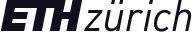
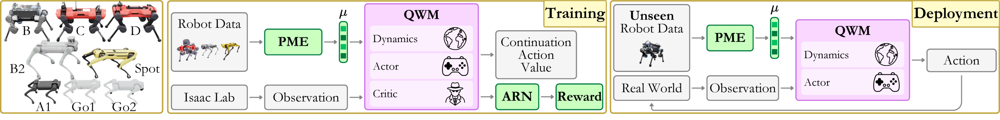
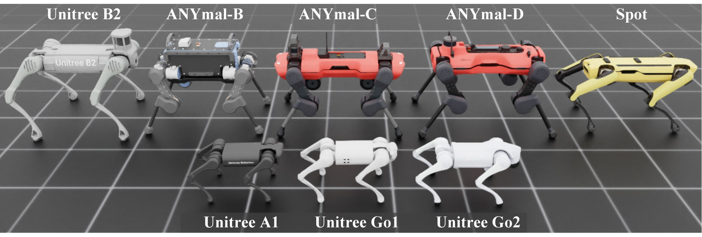
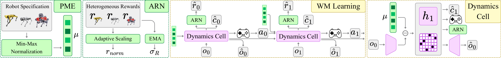
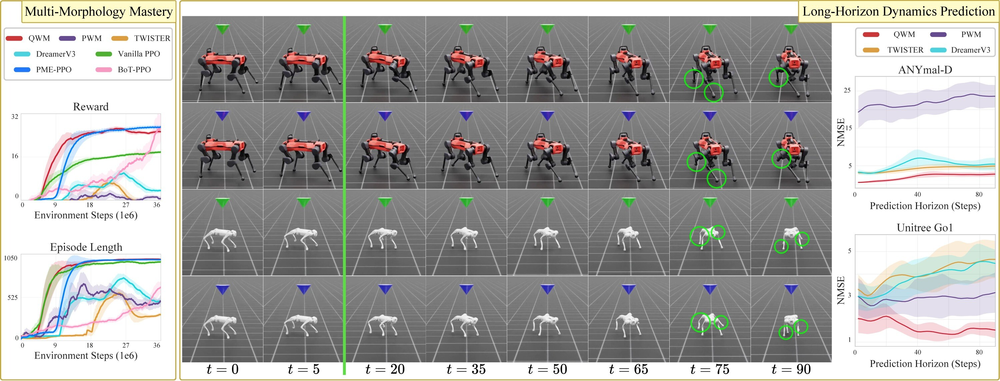
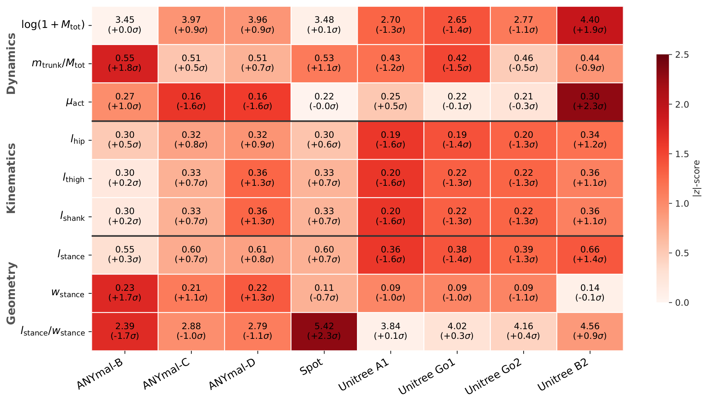
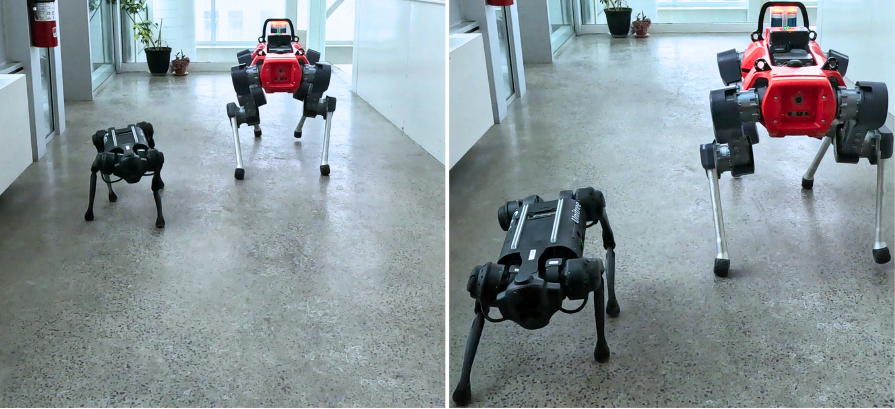
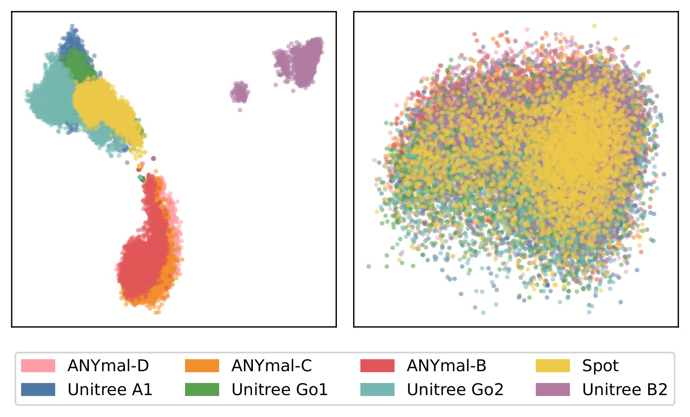
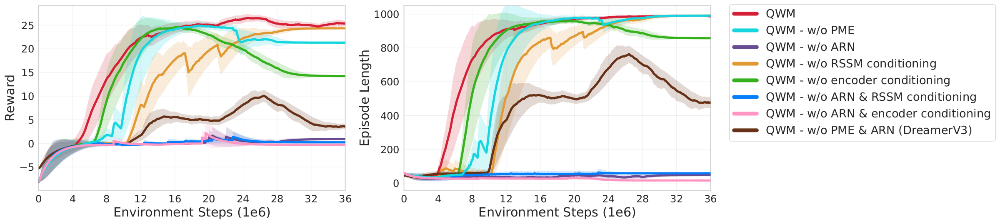

<style>
/* container: let this page breathe wider than the default column */
.main:has(.qwm-root) { max-width: 1220px; }
.main:has(.qwm-root) .post-header { margin-bottom: 0; }
.main:has(.qwm-root) .post-title {
  text-align: center;
  font-size: clamp(1.5rem, 1rem + 2.1vw, 2.1rem);
  line-height: 1.24;
  letter-spacing: -0.015em;
  max-width: 900px;
  margin: 10px auto 4px;
  text-wrap: balance;
}

/* scoped design tokens */
.qwm-root {
  --q-accent: #9a6a00;          /* readable gold on light bg (text, ticks, links) */
  --q-gold: #e3a017;            /* vivid gold for solid fills */
  --q-on-gold: #241800;         /* text on a gold fill */
  --q-accent-bd: rgba(199, 141, 20, 0.40);
  --q-accent-soft: rgba(227, 160, 23, 0.13);
  --q-mu: #0f9d58;
  --q-mu-bd: rgba(15, 157, 88, 0.30);
  --q-mu-soft: rgba(15, 157, 88, 0.09);
  --q-blue: #1583ad;
  --q-purple: #9333b8;
  --q-radius: 14px;
  --q-prose: none;
  font-size: 16.5px;
  line-height: 1.68;
  color: var(--content);
}
.dark .qwm-root {
  --q-accent: #f2b42e;
  --q-gold: #f2b42e;
  --q-on-gold: #241800;
  --q-accent-bd: rgba(242, 180, 46, 0.36);
  --q-accent-soft: rgba(242, 180, 46, 0.13);
  --q-mu: #43d18f;
  --q-mu-bd: rgba(67, 209, 143, 0.32);
  --q-mu-soft: rgba(67, 209, 143, 0.13);
  --q-blue: #54c1e8;
  --q-purple: #d183ee;
}

.qwm-root .qwm-prose { max-width: var(--q-prose); margin-inline: auto; }
.qwm-root .qwm-prose > p { margin: 0 0 1.05em; }
.qwm-root .qwm-prose > p:last-child { margin-bottom: 0; }
.qwm-root b, .qwm-root strong { color: var(--primary); font-weight: 700; }
.qwm-root .qwm-prose > p,
.qwm-root .qwm-abstract-body,
.qwm-root .qwm-tldr p,
.qwm-root .qwm-punch,
.qwm-root .qwm-route p,
.qwm-root .qwm-card p,
.qwm-root .qwm-callout {
  text-align: justify;
  text-justify: inter-word;
}

/* hero */
.qwm-hero { text-align: center; max-width: 840px; margin: 0.6rem auto 2.2rem; }
.qwm-venue {
  display: inline-block; margin-bottom: 1rem;
  padding: 0.4rem 1.05rem; border-radius: 999px;
  font-size: 0.8rem; font-weight: 700; letter-spacing: 0.03em;
  color: var(--q-accent);
  background: var(--q-accent-soft);
  border: 1px solid var(--q-accent-bd);
}
.qwm-authors { font-size: 1.02rem; line-height: 1.95; margin: 0 0 0.9rem; }
.qwm-authors sup { color: var(--q-accent); font-weight: 700; font-size: 0.62em; margin-left: 1px; }
.qwm-affils {
  display: flex; flex-wrap: wrap; gap: 0.5rem;
  justify-content: center; align-items: center; margin: 0;
}
.qwm-affils .logo {
  display: flex; align-items: center; justify-content: center;
  height: 40px; padding: 0 0.85rem; box-sizing: border-box;
  background: #fff; border-radius: 9px;
  border: 1px solid rgba(0, 0, 0, 0.07);
  box-shadow: 0 1px 3px rgba(0, 0, 0, 0.14);
}
.qwm-affils .logo img { height: 19px; width: auto; max-width: 132px; display: block; margin: 0; align-self: center; }
.qwm-affils .logo--udem img { height: 26px; max-width: 78px; }
@media (max-width: 460px) {
  .qwm-affils .logo { height: 33px; padding: 0 0.65rem; }
  .qwm-affils .logo img { height: 15px; max-width: 104px; }
  .qwm-affils .logo--udem img { height: 21px; max-width: 63px; }
}

.qwm-btns { display: flex; flex-wrap: wrap; gap: 0.55rem; justify-content: center; margin-top: 1.5rem; }
.qwm-root a.qwm-btn {
  display: inline-flex; align-items: center; gap: 0.45rem;
  padding: 0.5rem 1.05rem; border-radius: 999px;
  border: 1px solid var(--border); background: var(--entry);
  color: var(--primary) !important; box-shadow: none !important;
  font-size: 0.88rem; font-weight: 600; text-decoration: none !important;
  transition: transform 0.13s ease, border-color 0.13s ease, background 0.13s ease;
}
.qwm-root a.qwm-btn:hover { transform: translateY(-2px); border-color: var(--q-accent); }
.qwm-root a.qwm-btn svg { width: 15px; height: 15px; flex-shrink: 0; }
.qwm-root a.qwm-btn--primary { background: var(--q-gold); border-color: var(--q-gold); color: var(--q-on-gold) !important; }
.qwm-root a.qwm-btn--primary:hover { filter: brightness(1.06); border-color: var(--q-gold); }

/* section headings */
.qwm-root .qwm-h2 {
  font-size: 1.34rem; font-weight: 750; letter-spacing: -0.01em;
  margin: 3rem 0 1rem; padding-bottom: 0.4rem;
  border-bottom: 1px solid var(--border); color: var(--primary);
}
.qwm-root .qwm-h2::before {
  content: ""; display: inline-block; width: 0.6rem; height: 0.6rem;
  border-radius: 3px; background: var(--q-accent);
  margin-right: 0.6rem; transform: translateY(-2px);
}
.qwm-root .qwm-h2, .qwm-root .qwm-h3 { text-wrap: balance; }
.qwm-root .qwm-h3 { font-size: 1.06rem; font-weight: 700; margin: 2rem 0 0.6rem; color: var(--primary); }

/* figures */
.qwm-root .qwm-fig { margin: 1.7rem auto 1.9rem; }
.qwm-root .qwm-fig figure { margin: 0; }
.qwm-root .qwm-fig a { box-shadow: none !important; display: block; }
.qwm-root .qwm-fig img {
  display: block; width: 100%; height: auto; margin: 0;
  border-radius: var(--q-radius); background: #fff;
  border: 1px solid var(--border);
  box-shadow: 0 1px 3px rgba(0,0,0,0.05), 0 12px 32px -16px rgba(0,0,0,0.25);
}
.qwm-root .qwm-fig--pad img { padding: 16px; }
.qwm-root .qwm-fig--hero { margin-left: -18px; margin-right: -18px; }
.qwm-root .qwm-fig--hero img { padding: 10px; }
@media (max-width: 480px) { .qwm-root .qwm-fig--hero { margin-left: -8px; margin-right: -8px; } }
.qwm-root .qwm-fig--sm { max-width: 65%; margin-left: auto; margin-right: auto; }
@media (max-width: 640px) { .qwm-root .qwm-fig--sm { max-width: 100%; } }
.qwm-root .qwm-fig figcaption {
  margin: 0.75rem 0 0;
  font-size: 0.82rem; font-weight: 400; line-height: 1.55;
  color: var(--secondary); text-align: justify; text-justify: inter-word;
}
.qwm-root .qwm-fig figcaption b { color: var(--primary); }

/* TL;DR panel */
.qwm-tldr {
  margin: 1.8rem auto 2.2rem; padding: 1.4rem 1.5rem;
  border-radius: var(--q-radius);
  background: var(--q-accent-soft); border: 1px solid var(--q-accent-bd);
}
.qwm-tldr p { margin: 0; font-size: 1rem; line-height: 1.62; }
.qwm-stats {
  display: grid; grid-template-columns: repeat(4, 1fr); gap: 1rem;
  margin-top: 1.3rem; padding-top: 1.2rem;
  border-top: 1px solid var(--q-accent-bd);
}
.qwm-stat { text-align: center; }
.qwm-stat b { display: block; font-size: 1.45rem; font-weight: 800; color: var(--q-accent); line-height: 1.1; letter-spacing: -0.02em; }
.qwm-stat span { display: block; margin-top: 0.35rem; font-size: 0.75rem; color: var(--secondary); line-height: 1.4; }
@media (max-width: 620px) { .qwm-stats { grid-template-columns: repeat(2, 1fr); } }

/* two routes */
.qwm-routes { display: grid; grid-template-columns: 1fr 1fr; gap: 1rem; margin: 1.6rem 0; }
@media (max-width: 720px) { .qwm-routes { grid-template-columns: 1fr; } }
.qwm-route { border: 1px solid var(--border); border-radius: var(--q-radius); padding: 1.2rem 1.25rem; background: var(--entry); }
.qwm-route--b { border-color: var(--q-accent-bd); background: var(--q-accent-soft); }
.qwm-route .tag {
  display: inline-block; font-size: 0.66rem; text-transform: uppercase;
  letter-spacing: 0.07em; font-weight: 700; padding: 0.18rem 0.55rem;
  border-radius: 999px; background: var(--border); color: var(--secondary);
}
.qwm-route--b .tag { background: var(--q-gold); color: var(--q-on-gold); }
.qwm-route h4 { margin: 0.6rem 0 0.5rem; font-size: 0.98rem; font-weight: 700; color: var(--primary); text-transform: none; }
.qwm-route .flow {
  font-family: ui-monospace, SFMono-Regular, Menlo, Consolas, monospace;
  font-size: 0.77rem; color: var(--primary);
  background: var(--theme); border: 1px dashed var(--border);
  border-radius: 8px; padding: 0.5rem 0.6rem; margin: 0.4rem 0 0;
}
@media (max-width: 460px) { .qwm-route .flow { font-size: 0.7rem; } }
.qwm-route p { margin: 0.6rem 0 0; font-size: 0.86rem; color: var(--secondary); line-height: 1.6; }
.qwm-punch {
  margin: 0.2rem auto 0; max-width: var(--q-prose);
  font-size: 0.94rem; color: var(--content);
}

/* component cards */
.qwm-cards { display: grid; grid-template-columns: repeat(3, 1fr); gap: 1rem; margin: 1.6rem 0; }
@media (max-width: 820px) { .qwm-cards { grid-template-columns: 1fr; } }
.qwm-card {
  position: relative; overflow: hidden;
  border: 1px solid var(--border); border-radius: var(--q-radius);
  padding: 1.2rem 1.2rem 1.25rem; background: var(--entry);
}
.qwm-card::before { content: ""; position: absolute; inset: 0 0 auto 0; height: 3px; background: var(--c); }
.qwm-card .ic {
  width: 34px; height: 34px; border-radius: 9px; display: grid; place-items: center;
  background: var(--cs); color: var(--c); margin-bottom: 0.75rem;
}
.qwm-card .ic svg { width: 19px; height: 19px; }
.qwm-card h4 { margin: 0; font-size: 0.99rem; font-weight: 700; color: var(--primary); text-transform: none; }
.qwm-card .abbr {
  display: block; margin: 0.35rem 0 0.65rem; font-size: 0.95rem; font-weight: 600;
  font-family: ui-monospace, SFMono-Regular, Menlo, monospace; color: var(--c);
  line-height: 1.4; overflow-wrap: break-word;
}
.qwm-card p { margin: 0; font-size: 0.845rem; color: var(--secondary); line-height: 1.62; }

/* callout */
.qwm-callout {
  margin: 1.7rem 0; padding: 1.15rem 1.35rem;
  border-left: 3px solid var(--q-mu); background: var(--q-mu-soft);
  border-radius: 0 var(--q-radius) var(--q-radius) 0; font-size: 0.9rem; line-height: 1.62;
}
.qwm-callout b { color: var(--primary); }

/* equation */
.qwm-eq {
  margin: 1.3rem auto; padding: 0.9rem 1rem; max-width: 820px;
  text-align: center; background: var(--entry);
  border: 1px solid var(--border); border-radius: 10px;
  font-size: 0.95rem; overflow-x: auto;
}

/* video */
.qwm-video { margin: 1.5rem auto; }
.qwm-video video {
  display: block; width: 100%; height: auto;
  border-radius: var(--q-radius); border: 1px solid var(--border); background: #0d0d0d;
}
.qwm-video figcaption { margin: 0.6rem 0 0; font-size: 0.8rem; color: var(--secondary); text-align: justify; text-justify: inter-word; }
.qwm-video--sm { max-width: 82%; margin-left: auto; margin-right: auto; }
@media (max-width: 640px) { .qwm-video--sm { max-width: 100%; } }
.qwm-video--split { display: grid; grid-template-columns: 1fr 1fr; gap: 1rem; }
@media (max-width: 680px) { .qwm-video--split { grid-template-columns: 1fr; } }

/* tables */
.qwm-root .qwm-tw {
  display: block; width: 100%; overflow-x: auto; margin: 1.4rem 0;
  border: 1px solid var(--border); border-radius: var(--q-radius);
}
.qwm-root .qwm-t {
  display: table; width: 100%; min-width: 540px;
  table-layout: auto; border-collapse: collapse; border-spacing: 0;
  font-size: 0.85rem; margin: 0;
}
.qwm-root .qwm-t th, .qwm-root .qwm-t td {
  padding: 0.55rem 0.85rem; text-align: center; border: 0;
  border-bottom: 1px solid var(--border);
}
.qwm-root .qwm-t thead th { background: var(--entry); font-weight: 700; color: var(--primary); }
.qwm-root .qwm-t thead tr:last-child th { font-size: 0.76rem; color: var(--secondary); font-weight: 600; }
.qwm-root .qwm-t td:first-child, .qwm-root .qwm-t th:first-child { text-align: left; }
.qwm-root .qwm-t tbody tr:last-child td { border-bottom: 0; }
.qwm-root .qwm-t .row-hl td { background: var(--q-accent-soft); }
.qwm-root .qwm-t .row-hl td:first-child { color: var(--q-accent); font-weight: 700; }
.qwm-root .qwm-t .sep td { border-bottom: 2px solid var(--tertiary); }

/* details */
.qwm-root .qwm-details {
  margin: 1.4rem 0; border: 1px solid var(--border);
  border-radius: var(--q-radius); background: var(--entry); overflow: hidden;
}
.qwm-root .qwm-details > summary {
  cursor: pointer; padding: 0.85rem 1.1rem; font-size: 0.9rem; font-weight: 600;
  color: var(--primary); list-style: none;
}
.qwm-root .qwm-details > summary::-webkit-details-marker { display: none; }
.qwm-root .qwm-details > summary::before { content: "▸ "; color: var(--q-accent); }
.qwm-root .qwm-details[open] > summary::before { content: "▾ "; }
.qwm-root .qwm-details .qwm-fig { margin: 0.2rem 1.1rem 1.1rem; }
.qwm-root .qwm-details--abstract { margin: 1.8rem auto; }
.qwm-root .qwm-details--abstract > summary { font-size: 1.05rem; font-weight: 700; padding: 1rem 1.2rem; }
.qwm-root .qwm-details--abstract .qwm-abstract-body {
  padding: 0.2rem 1.2rem 1.2rem; font-size: 0.95rem; line-height: 1.7; color: var(--content);
}
.qwm-root .qwm-details--abstract .qwm-abstract-body b { color: var(--primary); }

/* footer links */
.qwm-foot {
  margin-top: 2.5rem; padding-top: 1.4rem; border-top: 1px solid var(--border);
  text-align: center; font-size: 0.86rem; color: var(--secondary);
}
.qwm-root .qwm-foot a { color: var(--q-accent); }
</style>

<div class="qwm-root">

<div class="qwm-hero">
  <div class="qwm-venue">Conference on Robot Learning&nbsp;·&nbsp;CoRL 2026</div>
  <div class="qwm-authors">
    Mohamad&nbsp;H.&nbsp;Danesh<sup>1,2</sup>&nbsp;&nbsp; Chenhao&nbsp;Li<sup>3</sup>&nbsp;&nbsp; Amin&nbsp;Abyaneh<sup>1,2</sup>&nbsp;&nbsp; Anas&nbsp;Houssaini<sup>1,2</sup><br>
    Kirsty&nbsp;Ellis<sup>2,4</sup>&nbsp;&nbsp; Glen&nbsp;Berseth<sup>2,4</sup>&nbsp;&nbsp; Marco&nbsp;Hutter<sup>3</sup>&nbsp;&nbsp; Hsiu-Chin&nbsp;Lin<sup>1,2</sup>
  </div>
  <div class="qwm-affils">
    <span class="logo"></span>
    <span class="logo"></span>
    <span class="logo"></span>
    <span class="logo logo--udem"></span>
  </div>
  <div class="qwm-btns">
    <a class="qwm-btn qwm-btn--primary" href="https://arxiv.org/abs/2604.08780" target="_blank" rel="noopener">
      <svg viewBox="0 0 24 24" fill="none" stroke="currentColor" stroke-width="2" stroke-linecap="round" stroke-linejoin="round"><path d="M14 2H6a2 2 0 0 0-2 2v16a2 2 0 0 0 2 2h12a2 2 0 0 0 2-2V8z"/><polyline points="14 2 14 8 20 8"/><line x1="16" y1="13" x2="8" y2="13"/><line x1="16" y1="17" x2="8" y2="17"/></svg>
      arXiv
    </a>
    <a class="qwm-btn" href="https://github.com/modanesh/QWM" target="_blank" rel="noopener">
      <svg viewBox="0 0 24 24" fill="currentColor"><path d="M12 .5C5.7.5.5 5.7.5 12c0 5.1 3.3 9.4 7.9 10.9.6.1.8-.3.8-.6v-2c-3.2.7-3.9-1.5-3.9-1.5-.5-1.3-1.3-1.7-1.3-1.7-1.1-.7.1-.7.1-.7 1.2.1 1.8 1.2 1.8 1.2 1 1.8 2.7 1.3 3.4 1 .1-.8.4-1.3.7-1.6-2.6-.3-5.3-1.3-5.3-5.7 0-1.3.5-2.3 1.2-3.1-.1-.3-.5-1.5.1-3.1 0 0 1-.3 3.3 1.2a11.5 11.5 0 0 1 6 0C18.3 4.7 19.3 5 19.3 5c.6 1.6.2 2.8.1 3.1.8.8 1.2 1.8 1.2 3.1 0 4.4-2.7 5.4-5.3 5.7.4.4.8 1.1.8 2.2v3.3c0 .3.2.7.8.6 4.6-1.5 7.9-5.8 7.9-10.9C23.5 5.7 18.3.5 12 .5z"/></svg>
      Code
    </a>
    <a class="qwm-btn" href="#bibtex">
      <svg viewBox="0 0 24 24" fill="none" stroke="currentColor" stroke-width="2" stroke-linecap="round" stroke-linejoin="round"><path d="M3 21c3 0 7-1 7-8V5a2 2 0 0 0-2-2H4a2 2 0 0 0-2 2v6a2 2 0 0 0 2 2h4"/><path d="M14 21c3 0 7-1 7-8V5a2 2 0 0 0-2-2h-4a2 2 0 0 0-2 2v6a2 2 0 0 0 2 2h4"/></svg>
      BibTeX
    </a>
  </div>
</div>

<details class="qwm-details qwm-details--abstract">
<summary>Abstract</summary>
<div class="qwm-abstract-body">
World models promise a paradigm shift in robotics, where an agent learns the physics of its environment once and then acquires behaviors efficiently. Yet the learned dynamics models at their core are typically morphology locked. In legged locomotion, a dynamics model trained on an ANYmal-D quadruped fails on a Unitree Go1 because it overfits to one robot's embodiment rather than capturing the locomotion dynamics shared across robots, so even a small change in actuator dynamics or limb length forces retraining from scratch. However, if we formalize a robot's unique physical traits into a morphology specification, a controller for a family of robots can utilize this blueprint in two ways. It can feed the specification to a model-free policy, or it can feed the specification to a learned dynamics model and extract the policy in imagination. We argue for the second route and introduce the <b>Quadrupedal World Model (QWM)</b>, which conditions a single generative dynamics model on scale-invariant physical features and trains policies entirely inside it, through a physical morphology encoder, an adaptive reward normalizer, and morphology conditioning in the latent dynamics. Holding the morphology information identical, a model-free policy matches QWM on the training cohort but degrades on unseen morphologies, while QWM transfers zero-shot with no fine-tuning, adaptation, or warm-up. To our knowledge, this is the first world model to demonstrate zero-shot cross-embodiment transfer within the quadrupedal family.
</div>
</details>

<figure class="qwm-fig qwm-fig--pad qwm-fig--hero">
  <a href="project_assets/overview.png" target="_blank" rel="noopener"></a>
  <figcaption>
    <b>QWM</b> conditions a single world model on a robot's <em>morphology vector</em> $\mu$ — scale-invariant physical features read from its description file.
    <b>Training:</b> the Physical Morphology Encoder (PME) extracts $\mu$; a DreamerV3-style world model learns the locomotion dynamics shared across robots while the Adaptive Reward Normalizer (ARN) balances reward scales; actor and critic are learned entirely in imagination.
    <b>Deployment:</b> injecting the $\mu$ of an unseen quadruped turns the frozen model into a neural simulator for that robot, and the frozen policy runs on it zero-shot.
  </figcaption>
</figure>

<div class="qwm-tldr">
  <p><b>A robot's morphology should be routed <em>through</em> learned dynamics, not fed straight to a policy.</b> Dynamics within a morphological family vary smoothly — stretch a limb or add mass and the equations of motion move continuously — but the optimal gait can change abruptly. A world model conditioned on $\mu$ can therefore synthesize a coherent simulator for an unseen robot by interpolating in physical-feature space, and a policy re-derived against that simulator inherits the generalization. A policy that maps $\mu$ straight to actions has to generalize a much rougher function, and it breaks.</p>
  <div class="qwm-stats">
    <div class="qwm-stat"><b>8</b><span>morphologies, one world model</span></div>
    <div class="qwm-stat"><b>0 falls</b><span>across 20 hardware trials on held-out robots</span></div>
    <div class="qwm-stat"><b>zero-shot</b><span>no fine-tuning, adaptation, or warm-up</span></div>
    <div class="qwm-stat"><b>~2&times;</b><span>sample efficiency vs. a model-free policy with the same&nbsp;μ</span></div>
  </div>
</div>

<h2 class="qwm-h2">Two ways to use a morphology spec</h2>

<div class="qwm-prose">
<p>Formalize a robot's physical traits — limb lengths, mass distribution, actuator limits — into a morphology vector $\mu$. A controller for a family of robots can use that blueprint in two ways.</p>
</div>

<div class="qwm-routes">
  <div class="qwm-route qwm-route--a">
    <span class="tag">Model-free</span>
    <h4>μ&nbsp;→&nbsp;policy</h4>
    <p class="flow">μ, oₜ &nbsp;→&nbsp; π &nbsp;→&nbsp; aₜ</p>
    <p>Feed μ straight to the policy and learn control directly. The policy must approximate a function that can change sharply between nearby morphologies. It matches QWM on the training cohort, but degrades on unseen robots and collapses on out-of-distribution ones.</p>
  </div>
  <div class="qwm-route qwm-route--b">
    <span class="tag">QWM · model-based</span>
    <h4>μ&nbsp;→&nbsp;world model&nbsp;→&nbsp;policy in imagination</h4>
    <p class="flow">μ, oₜ &nbsp;→&nbsp; world model &nbsp;→&nbsp; π &nbsp;(in imagination)</p>
    <p>Feed μ to a learned dynamics model, then recover the policy by training against it in imagination. The model only has to interpolate smooth physics; the policy inherits that generalization and transfers zero-shot to robots outside the training set.</p>
  </div>
</div>

<p class="qwm-punch">Our experiments hold $\mu$ <b>identical</b> between the two routes. On the training cohort they are indistinguishable, so any later gap is a generalization gap, not a capability gap. Only the model-based route crosses it.</p>

<figure class="qwm-fig qwm-fig--pad">
  <a href="project_assets/cohort.jpg" target="_blank" rel="noopener"></a>
  <figcaption>The heterogeneous cohort: ANYmal-B/C/D, Unitree A1/Go1/Go2/B2, and Boston Dynamics Spot. The robots span an order of magnitude in mass, both knee topologies (inward "X" vs. outward "dog-like"), and non-linear variation in limb ratios and hip offsets.</figcaption>
</figure>

<h2 class="qwm-h2">How QWM works</h2>

<div class="qwm-prose">
<p>QWM builds on DreamerV3 and changes three things so that a single model can serve a whole kinematic family.</p>
</div>

<figure class="qwm-fig qwm-fig--pad">
  <a href="project_assets/architecture.png" target="_blank" rel="noopener"></a>
  <figcaption><b>PME</b> maps a robot description to a normalized morphology vector $\mu$. <b>ARN</b> rescales each robot's rewards by an EMA of its own return spread. The <b>dynamics cell</b> fuses $\mu$ with proprioception in a dual-tower encoder and re-injects $\mu$ into the recurrent state at every step.</figcaption>
</figure>

<div class="qwm-cards">
  <div class="qwm-card" style="--c: var(--q-mu); --cs: var(--q-mu-soft);">
    <div class="ic"><svg viewBox="0 0 24 24" fill="none" stroke="currentColor" stroke-width="2" stroke-linecap="round" stroke-linejoin="round"><path d="M12 2 2 7l10 5 10-5-10-5z"/><path d="m2 17 10 5 10-5"/><path d="m2 12 10 5 10-5"/></svg></div>
    <h4>Physical Morphology Encoder</h4>
    <span class="abbr">robot description → μ ∈ [−1,1]¹⁰</span>
    <p>Reads four feature groups from the robot's description — kinematics &amp; topology (limb lengths, knee configuration), geometry (stance footprint), dynamics (log-scaled mass, trunk fraction), and actuation (weight-normalized torque) — and min-max normalizes them to $\mu \in [-1,1]^{10}$. A shallow tower keeps this static signal from being washed out by high-variance proprioception.</p>
  </div>
  <div class="qwm-card" style="--c: var(--q-purple); --cs: rgba(147,51,184,0.10);">
    <div class="ic"><svg viewBox="0 0 24 24" fill="none" stroke="currentColor" stroke-width="2" stroke-linecap="round" stroke-linejoin="round"><path d="M3 12a9 9 0 1 0 18 0 9 9 0 0 0-18 0z"/><path d="M3 12h18M12 3a15 15 0 0 1 0 18M12 3a15 15 0 0 0 0 18"/></svg></div>
    <h4>Morphology-conditioned dynamics</h4>
    <span class="abbr">hₜ = f(hₜ₋₁, zₜ₋₁, aₜ₋₁, μ)</span>
    <p>$\mu$ is injected into the recurrent state every step, so the GRU tracks <em>dynamic</em> state (velocity, contact timing) while explicit conditioning carries the <em>static</em> physics (limb length, mass). The stochastic latent $z_t$ is then free to encode only morphology-independent dynamics.</p>
  </div>
  <div class="qwm-card" style="--c: var(--q-blue); --cs: rgba(21,131,173,0.10);">
    <div class="ic"><svg viewBox="0 0 24 24" fill="none" stroke="currentColor" stroke-width="2" stroke-linecap="round" stroke-linejoin="round"><path d="M3 12h4l3 8 4-16 3 8h4"/></svg></div>
    <h4>Adaptive Reward Normalizer</h4>
    <span class="abbr">σ_R ← EMA(P₉₅ − P₀₅)</span>
    <p>Spot earns &asymp;350 reward per episode; ANYmal-D &asymp;25. Without rescaling, big-reward robots dominate the world-model loss and it collapses to a mean-dynamics solution. A per-robot EMA of the 5–95 percentile return range equalizes the learning signal.</p>
  </div>
</div>

<div class="qwm-eq">
$$h_t = f_\phi(h_{t-1},\, z_{t-1},\, a_{t-1},\, \mu) \qquad e_t = \mathrm{Linear}\big[\,\mathrm{MLP}_{\mathrm{dyn}}(o_t),\ \mathrm{MLP}_{\mathrm{stat}}(\mu)\,\big] \qquad z_t \sim q_\phi(z_t \mid h_t,\, e_t)$$
</div>

<div class="qwm-callout">
  <b>Training QWM needs eight morphologies stepping inside one simulator</b> — distinct collision geometries, kinematic trees, actuator gains, and reward definitions — which Isaac Lab does not support out of the box. We built <b>Hetero-Isaac</b>, an Isaac Lab extension that runs a heterogeneous batch indexed per environment. The full infrastructure — joint-order unification, index mapping, padded reward functions — is described in the companion post: <a href="/blog/hetero-isaaclab/">Heterogeneous Environments in Isaac Lab</a>.
</div>

<figure class="qwm-video">
  <video autoplay muted loop playsinline preload="metadata" poster="project_assets/hetero_train-poster.jpg">
    <source src="project_assets/hetero_train.mp4" type="video/mp4">
  </video>
  <figcaption>Eight quadrupeds training in parallel in Hetero-Isaac.</figcaption>
</figure>

<h2 class="qwm-h2">Results</h2>

<h3 class="qwm-h3">Multi-morphology mastery &amp; dynamics fidelity</h3>

<figure class="qwm-fig qwm-fig--pad">
  <a href="project_assets/results_main.jpg" target="_blank" rel="noopener"></a>
  <figcaption>
    <b>Left:</b> one QWM trained on the full 8-robot cohort vs. model-free (Vanilla PPO, PME-PPO, BoT-PPO) and world-model (DreamerV3, PWM, TWISTER) baselines. Methods given $\mu$ explicitly master the cohort; methods that must infer morphology from history settle for a mean-dynamics solution.
    <b>Right:</b> 5-step context, then 85 steps of pure imagination — QWM's open-loop rollout (blue) stays locked to ground-truth physics (green) across scales, with NMSE accumulating gradually rather than diverging.
  </figcaption>
</figure>

<div class="qwm-prose">
<p>Given the same $\mu$, PME-PPO eventually reaches QWM's asymptotic reward — but QWM gets there in about half the environment steps and leaves behind a reusable dynamics model. On the training cohort the two routes are a capability tie, which is exactly what makes the generalization comparison clean.</p>
</div>

<figure class="qwm-video qwm-video--sm">
  <video autoplay muted loop playsinline preload="metadata" poster="project_assets/imag-poster.jpg">
    <source src="project_assets/imag.mp4" type="video/mp4">
  </video>
  <figcaption>Open-loop imagination vs. ground-truth simulation for three robots. QWM predicts gait-level dynamics for all of them from one set of weights.</figcaption>
</figure>

<h3 class="qwm-h3">Zero-shot transfer to unseen morphologies</h3>

<div class="qwm-prose">
<p>To evaluate a target robot, we train from scratch on the other seven and run the frozen model and policy on the target using only its $\mu$. Go1 and ANYmal-D sit inside the cohort's per-axis range; B2 is heavier, stronger, and longer-stanced all at once — each deviation individually bounded, but jointly unrepresented (a <em>combinatorial</em> gap).</p>
</div>

<div class="qwm-tw">
<table class="qwm-t">
  <thead>
    <tr><th rowspan="2">Method</th><th colspan="2">ANYmal-D <span style="font-weight:400">(in-range)</span></th><th colspan="2">Unitree Go1 <span style="font-weight:400">(in-range)</span></th><th colspan="2">Unitree B2 <span style="font-weight:400">(combinatorial gap)</span></th></tr>
    <tr><th>Reward</th><th>Ep. length</th><th>Reward</th><th>Ep. length</th><th>Reward</th><th>Ep. length</th></tr>
  </thead>
  <tbody>
    <tr><td>PME-PPO <span style="color:var(--secondary)">(same $\mu$, model-free)</span></td><td>10.1</td><td>530</td><td>23.1</td><td>602</td><td>&minus;0.2</td><td>337</td></tr>
    <tr class="row-hl"><td>QWM <span style="color:var(--secondary)">(zero-shot)</span></td><td>18.2</td><td>949</td><td>35.5</td><td>974</td><td>12.1</td><td>925</td></tr>
    <tr><td>Specialist PPO <span style="color:var(--secondary)">(oracle, trained on target)</span></td><td>21.8</td><td>981</td><td>39.7</td><td>996</td><td>13.6</td><td>961</td></tr>
  </tbody>
</table>
</div>

<div class="qwm-prose">
<p>PME-PPO, reading the identical $\mu$, trails by 350–600 steps of episode length and collapses entirely on B2. QWM stays within ~4% of specialist episode length and recovers 80–90% of specialist reward on the in-range robots, and still walks B2 zero-shot at near-specialist episode length.</p>
</div>

<details class="qwm-details">
  <summary>Per-feature morphology deviation — why B2 is the hard case</summary>
  <figure class="qwm-fig qwm-fig--pad">
    
    <figcaption>Leave-one-out $z$-scores per physical feature (value on top, signed deviation below). Go1 never exceeds $1.5\sigma$ on any axis. B2 crosses $2\sigma$ on torque capacity and $1.9\sigma$ on log-mass, with every elevated feature pushing the same direction — larger, heavier, stronger — so no single training robot combines them.</figcaption>
  </figure>
</details>

<h3 class="qwm-h3">Real-world deployment</h3>

<div class="qwm-prose">
<p>The frozen zero-shot ANYmal-D and Go1 policies run directly on hardware — exact simulation weights, 50&nbsp;Hz inference on each robot's onboard computer, no real-world fine-tuning. QWM produces a high-frequency trot on the agile Go1 and a slower, grounded gait on the heavier ANYmal-D.</p>
</div>

<figure class="qwm-fig qwm-fig--sm">
  <a href="project_assets/real_robot.jpg" target="_blank" rel="noopener"></a>
  <figcaption>Zero-shot deployment on the held-out Unitree Go1 and ANYmal-D, both walking in an indoor corridor.</figcaption>
</figure>

<div class="qwm-video qwm-video--split">
  <figure style="margin:0;">
    <video autoplay muted loop playsinline preload="metadata" poster="project_assets/anymald-poster.jpg"><source src="project_assets/anymald.mp4" type="video/mp4"></video>
    <figcaption>ANYmal-D — zero-shot, held out during training</figcaption>
  </figure>
  <figure style="margin:0;">
    <video autoplay muted loop playsinline preload="metadata" poster="project_assets/go1-poster.jpg"><source src="project_assets/go1.mp4" type="video/mp4"></video>
    <figcaption>Unitree Go1 — zero-shot, held out during training</figcaption>
  </figure>
</div>

<div class="qwm-tw">
<table class="qwm-t">
  <thead>
    <tr><th>Platform</th><th>Method</th><th>$e_{xy}$ (m/s) &darr;</th><th>$e_{yaw}$ (rad/s) &darr;</th></tr>
  </thead>
  <tbody>
    <tr class="row-hl"><td>ANYmal-D</td><td>QWM (zero-shot)</td><td>0.30</td><td>0.29</td></tr>
    <tr class="sep"><td>ANYmal-D</td><td>Specialist PPO</td><td>0.28</td><td>0.26</td></tr>
    <tr class="row-hl"><td>Unitree Go1</td><td>QWM (zero-shot)</td><td>0.34</td><td>0.34</td></tr>
    <tr><td>Unitree Go1</td><td>Specialist PPO</td><td>0.31</td><td>0.30</td></tr>
  </tbody>
</table>
</div>

<div class="qwm-prose">
<p>Zero falls across all 20 trials (10 per platform &times; 60&nbsp;s), with velocity-tracking error within ~10–13% of a specialist controller trained only on that robot.</p>
</div>

<h3 class="qwm-h3">Why the model-based route wins</h3>

<div class="qwm-prose">
<p>Because $\mu$ is handed to the recurrent state $h_t$, the stochastic latent $z_t$ never has to re-infer physical identity — it encodes only dynamic state. Probing confirms it: $h_t$ splits cleanly into per-robot clusters, while $z_t$ collapses into one morphology-agnostic cloud (silhouette 0.033).</p>
</div>

<figure class="qwm-fig qwm-fig--pad qwm-fig--sm">
  <a href="project_assets/latent_disentangle.jpg" target="_blank" rel="noopener"></a>
  <figcaption>PCA of the $\mu$-conditioned recurrent state $h_t$ (left) and the stochastic state $z_t$ (right), colored by robot. $h_t$ carries morphological identity; $z_t$ does not.</figcaption>
</figure>

<div class="qwm-prose">
<p>That decoupling is a correction channel a spec-sheet policy structurally lacks. Corrupt $\mu$ by 20% and QWM keeps ~80% of its episode length while PME-PPO drops to ~33%, because $z_t$ re-reads the true dynamics from observations. Hold $\mu$ correct but degrade the real robot — 20% torque loss, or a trunk payload — and even a near-exact analytical rigid-body predictor diverges, while QWM stays within 75–84% of its nominal episode length.</p>
</div>

<h3 class="qwm-h3">Ablations</h3>

<figure class="qwm-fig qwm-fig--pad">
  <a href="project_assets/ablations.png" target="_blank" rel="noopener"></a>
  <figcaption>Each component fails differently. <b>No ARN:</b> flatline near zero — heterogeneous reward scales alone prevent the world model from forming. <b>No encoder conditioning:</b> learns, then collapses late. <b>No RSSM conditioning:</b> slow, sub-optimal asymptote. <b>No explicit $\mu$:</b> stays upright but plateaus below refined gaits.</figcaption>
</figure>

<h2 class="qwm-h2">Limitations</h2>

<div class="qwm-prose">
<p>$\mu$ encodes a fixed quadrupedal template — three-segment legs, a 12-DoF action space, and a hip-rooted stance — so generalization is parametric <em>within</em> that template, not across structural variants such as differing joints per leg or non-quadrupedal bodies. Evaluation is blind flat-ground velocity tracking, without exteroception or contact-rich terrain.</p>
</div>

<h2 class="qwm-h2" id="bibtex">BibTeX</h2>

</div>

```bibtex
@inproceedings{danesh2026qwm,
  title     = {Morphology-Conditioned World Model for Cross-Embodiment Quadrupedal Locomotion},
  author    = {Danesh, Mohamad H. and Li, Chenhao and Abyaneh, Amin and Houssaini, Anas
               and Ellis, Kirsty and Berseth, Glen and Hutter, Marco and Lin, Hsiu-Chin},
  booktitle = {Conference on Robot Learning (CoRL)},
  year      = {2026},
  url       = {https://arxiv.org/abs/2604.08780}
}
```

<div class="qwm-root">
<div class="qwm-foot">
  <a href="https://arxiv.org/abs/2604.08780">arXiv</a>&nbsp;&nbsp;·&nbsp;&nbsp;<a href="https://github.com/modanesh/QWM">Code</a>&nbsp;&nbsp;·&nbsp;&nbsp;<a href="/blog/hetero-isaaclab/">Hetero-Isaac blog</a>
</div>
</div>
